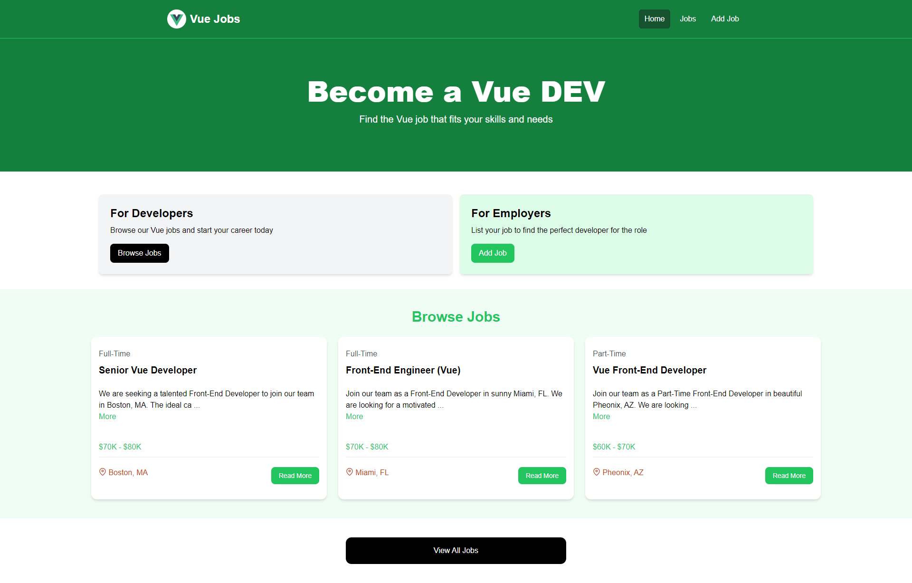
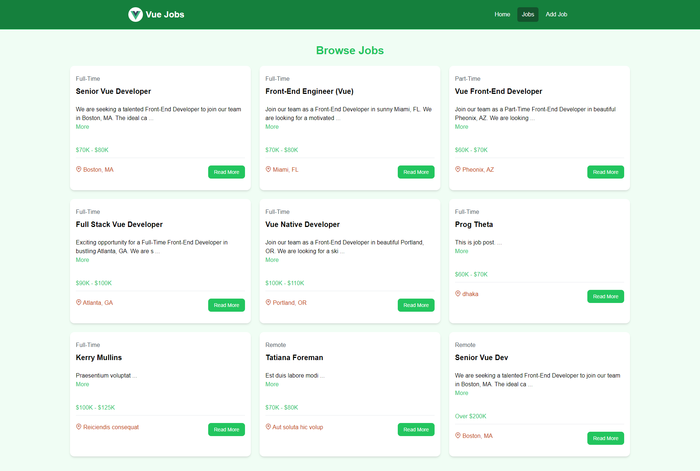
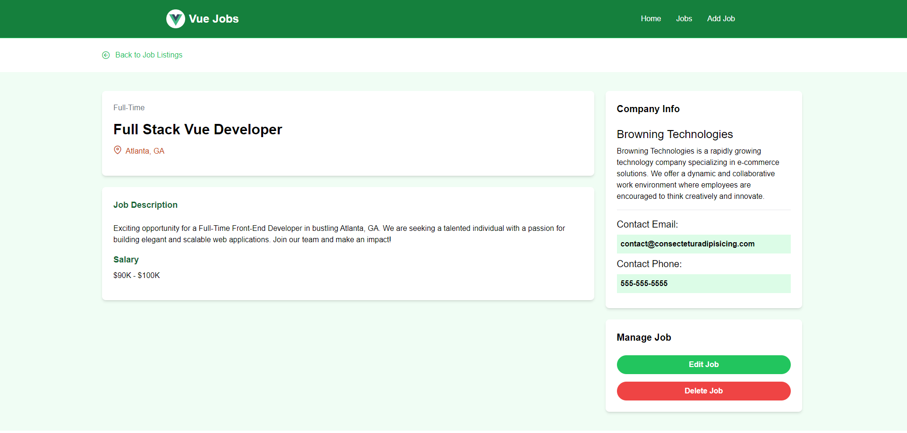
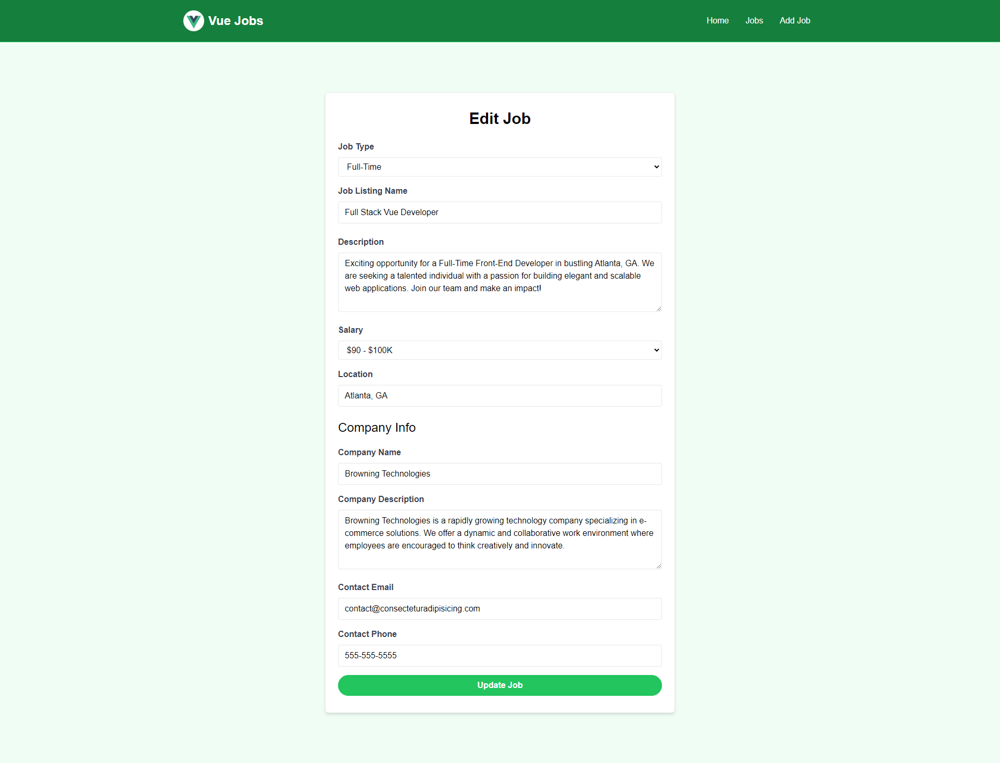

# UVE Practice Project - Job Posting and Applying

This project is a Vue.js application for job postings and applying for jobs. It allows users to view job listings and submit applications dynamically.


## Home
 

## VIEW ALL JOBS



## View Job details


## Edit Job


## Features
- Browse job postings
- Apply for jobs online
- Responsive design

## Technologies Used
- **Vue.js**: Frontend framework
- **Vite**: Build tool for faster development
- **Netlify**: Hosting and deployment
- **JSON Server**: Mock API for job listings

## Project Setup

### Clone the Repository
```bash
git clone https://github.com/anikakash/JobPostingSite-VUE.git
cd JobPostingSite-VUE
```

### Install Dependencies
```
 npm install
```
### Run server
```
npm install
```
### Run Mock JSON Server (optional)
```
json-server --watch db.json --port 5000
```

### For production Build

```
npm run build
```
